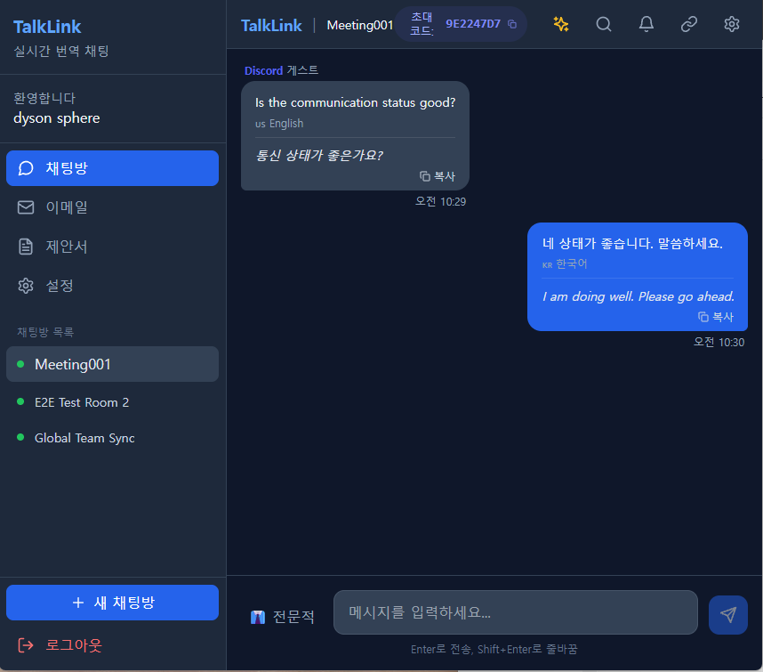

# 🌐 TalkLink (토크링크)

<div align="center">

**TalkLink**는 언어의 장벽 없이 자유롭게 소통할 수 있는 **실시간 자동 번역 채팅 플랫폼**입니다.

Socket.io를 활용한 실시간 통신과 AI 기반 번역 기술을 결합하여, 서로 다른 언어를 사용하는 사용자들이 매끄럽게 대화할 수 있는 환경을 제공합니다.

[](LICENSE)
[](https://nodejs.org)
[](https://reactjs.org)
[](https://socket.io)

</div>

---

## 📋 목차

- [주요 기능](#-주요-기능-key-features)
- [스크린샷](#-스크린샷-screenshots)
- [기술 스택](#-기술-스택-tech-stack)
- [시작하기](#-시작하기-getting-started)
- [사용법](#-사용법-usage)
- [프로젝트 구조](#-프로젝트-구조-project-structure)
- [API 설정](#-api-설정)
- [Discord 연동](#-discord-연동)
- [로드맵](#-로드맵-roadmap)
- [라이선스](#-라이선스-license)

---

## ✨ 주요 기능 (Key Features)

| 기능 | 설명 |
|------|------|
| 💬 **실시간 채팅** | Socket.io 기반의 지연 없는 메시지 전송 |
| 🤖 **Discord 연동** | Discord 봇을 통한 양방향 메시지 동기화 및 실시간 번역 |
| 🌏 **AI 자동 번역** | 한국어 ↔ 영어 실시간 번역 (OpenRouter 다중 모델 지원) |
| 🔒 **보안 인증** | JWT 기반 호스트 인증 및 세션 관리 |
| 🎫 **게스트 모드** | 초대 코드를 통한 간편한 익명 입장 |
| 👥 **채팅방 관리** | 무제한 채팅방 생성 및 초대 코드 관리 |
| ⚙️ **모델 선택** | GPT-4o, Claude 3.5, Gemini 2.0 등 AI 모델 선택 가능 |
| 📜 **대화 기록** | SQLite 기반 영구 저장 및 검색 |

---

## 📸 스크린샷 (Screenshots)



---

## 🛠 기술 스택 (Tech Stack)

### Backend

| 기술 | 용도 |
|------|------|
| Node.js (v18+) | 런타임 환경 |
| Express.js | 웹 프레임워크 |
| Socket.io | 실시간 양방향 통신 |
| SQLite3 | 경량 데이터베이스 |
| JWT + bcryptjs | 인증 및 암호화 |
| discord.js | Discord 봇 연동 |

### Frontend

| 기술 | 용도 |
|------|------|
| React 18 (Vite) | UI 프레임워크 |
| TailwindCSS | 스타일링 |
| Lucide React | 아이콘 |
| Socket.io Client | 실시간 통신 |

### AI / Translation

| 기술 | 용도 |
|------|------|
| OpenRouter API | 다중 LLM 접근 (GPT-4o, Claude, Gemini 등) |
| Tavily API | 웹 검색 (AI 어시스턴트용) |

---

## 🚀 시작하기 (Getting Started)

### 필수 요건

- **Node.js** v18.0.0 이상
- **npm** 또는 **yarn**
- **OpenRouter API Key** (번역 기능 필수)

### 설치

```bash
# 1. 레포지토리 클론
git clone https://github.com/fitz04/TalkLink.git
cd TalkLink

# 2. 백엔드 의존성 설치
npm install

# 3. 프론트엔드 의존성 설치
cd client && npm install && cd ..
```

### 환경 변수 설정

루트 디렉토리에 `.env` 파일을 생성합니다:

```env
# 서버 설정
PORT=3000
JWT_SECRET=your_secure_jwt_secret_here

# API 키 (선택 - 앱 내 설정 가능)
OPENROUTER_API_KEY=sk-or-v1-xxxxx
TAVILY_API_KEY=tvly-xxxxx
```

> 💡 API 키는 앱 실행 후 **설정 > API Keys**에서도 입력할 수 있습니다.

### 실행

**개발 모드** (두 개의 터미널 필요):

```bash
# 터미널 1: 백엔드 서버 (Port 3000)
npm run server

# 터미널 2: 프론트엔드 (Port 5173)
cd client && npm run dev
```

브라우저에서 **<http://localhost:5173>** 접속

---

## 📖 사용법 (Usage)

### 호스트 (Host)

1. **회원가입**: 이메일, 비밀번호, 이름 입력
2. **로그인**: 호스트 계정으로 로그인
3. **채팅방 생성**: 사이드바 하단 "새 채팅방" 클릭
4. **초대 코드 공유**: 헤더에 표시된 초대 코드 복사 후 게스트에게 전달
5. **번역 채팅**: 메시지 전송 시 자동 번역

### 게스트 (Guest)

1. **로그인 화면**에서 "게스트로 참여하기" 클릭
2. **초대 코드** 입력 (호스트에게 받은 8자리 코드)
3. **닉네임** 입력
4. **채팅 참여**: 자동으로 채팅방에 연결됨

### 모델 설정

1. **설정** (톱니바퀴 아이콘) 클릭
2. **OpenRouter API Key** 입력 및 저장
3. **사용 모델** 선택:
   - GPT-4o Mini (빠름/저렴)
   - Gemini 2.0 Flash (균형)
   - Claude 3 Haiku (자연스러움)
   - GPT-4o (고성능)
   - Claude 3.5 Sonnet (최고 성능)

---

## 📂 프로젝트 구조 (Project Structure)

```
TalkLink/
├── client/                     # 프론트엔드 (React + Vite)
│   ├── src/
│   │   ├── components/
│   │   │   ├── Chat/           # 채팅 관련 컴포넌트
│   │   │   ├── Layout/         # 레이아웃 (Header, Sidebar, Login)
│   │   │   └── Settings/       # 설정 패널
│   │   ├── hooks/              # 커스텀 훅 (useSocket)
│   │   ├── lib/                # 유틸리티 (api.js)
│   │   └── App.jsx             # 앱 루트
│   └── ...
├── server/                     # 백엔드 (Node.js + Express)
│   ├── routes/                 # API 라우트
│   │   ├── auth.js             # 인증 API
│   │   ├── rooms.js            # 채팅방 API
│   │   ├── settings.js         # 설정 API
│   │   └── integrations.js     # Discord 연동 API
│   ├── socket/                 # Socket.io 핸들러
│   │   ├── auth.js             # 소켓 인증
│   │   └── chatHandler.js      # 채팅 메시지 처리
│   ├── services/               # 비즈니스 로직
│   │   ├── translate.js        # 번역 서비스
│   │   └── discordBot.js       # Discord 봇 서비스
│   ├── db.js                   # SQLite 데이터베이스
│   └── index.js                # 서버 엔트리포인트
├── data/                       # SQLite DB 파일
├── logs/                       # 서버 로그
├── .agent/                     # AI 에이전트 설정
│   ├── rules/                  # 코딩 규칙
│   ├── skills/                 # 자동화 스킬
│   ├── SESSION_HANDOFF.md      # 세션 핸드오프
│   └── AGENT_GUIDE.md          # 에이전트 가이드
└── README.md
```

---

## 🔑 API 설정

### OpenRouter (필수)

1. [OpenRouter](https://openrouter.ai) 가입
2. API Key 발급
3. TalkLink 설정에서 입력

**지원 모델**:

- `openai/gpt-4o-mini` - 빠르고 저렴 (기본값)
- `openai/gpt-4o` - 고성능
- `anthropic/claude-3-haiku` - 자연스러운 번역
- `anthropic/claude-3.5-sonnet` - 최고 품질
- `google/gemini-2.0-flash-001` - 균형잡힌 성능

### Tavily (선택)

AI 어시스턴트의 웹 검색 기능에 사용됩니다.

1. [Tavily](https://tavily.com) 가입
2. API Key 발급
3. TalkLink 설정에서 입력

---

## 🤖 Discord 연동

TalkLink 채팅방을 Discord 채널과 양방향 동기화할 수 있습니다.

### 설정 방법

1. [Discord Developer Portal](https://discord.com/developers/applications)에서 봇 생성
2. **Bot** 탭에서:
   - **TOKEN** 복사
   - **MESSAGE CONTENT INTENT** 활성화 ⚠️ 필수!
3. 봇을 Discord 서버에 초대
4. TalkLink에서:
   - 채팅방 선택 → 헤더의 🔗 아이콘 클릭
   - Bot Token 입력
   - Channel ID 입력 (채널 우클릭 → "Copy Channel ID")
   - 활성화

### 기능

- TalkLink → Discord: 메시지 자동 전송
- Discord → TalkLink: 메시지 수신 + 자동 번역
- Discord 사용자명 표시 (파란색 "Discord" 태그)

---

## 🗺 로드맵 (Roadmap)

### v1.0 ✅ (현재)

- [x] 실시간 채팅
- [x] 한영 자동 번역
- [x] 게스트 모드
- [x] Discord 연동
- [x] AI 모델 선택

### v1.1 (예정)

- [ ] AI 모델 파라미터 설정 (Temperature, Max Tokens)
- [ ] 사용자 정의 모델 추가
- [ ] 번역 언어 확장 (일본어, 중국어 등)

### v2.0 (계획)

- [ ] Slack 연동
- [ ] 음성 메시지 번역
- [ ] 모바일 앱 (React Native)

---

## 🤝 기여 (Contributing)

1. Fork the Project
2. Create your Feature Branch (`git checkout -b feature/AmazingFeature`)
3. Commit your Changes (`git commit -m 'Add some AmazingFeature'`)
4. Push to the Branch (`git push origin feature/AmazingFeature`)
5. Open a Pull Request

---

## 📝 라이선스 (License)

This project is licensed under the **MIT License** - see the [LICENSE](LICENSE) file for details.

---

<div align="center">

Made with ❤️ by [fitz04](https://github.com/fitz04)

</div>
